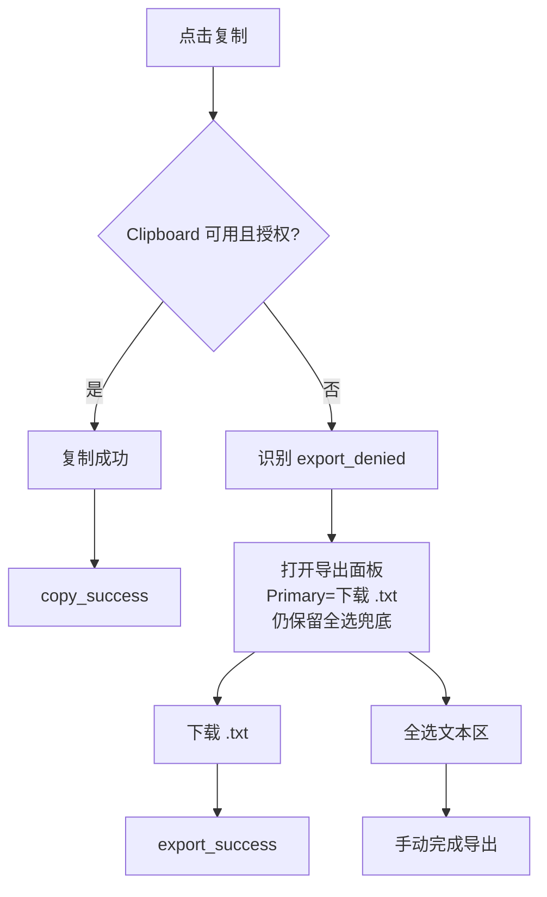

# UX Design Specification Qomo

**Author:** drogbaqu
**Date:** 2025-12-29

---

## Step 2 - Project Understanding（共识基线）

### 产品定位与北极星体验
- **产品定位**：离线优先的 Prompt 资产工作台。核心价值不是“写 Prompt”，而是让 Prompt 可复用、可迁移、可治理，并且在一次会话内稳定完成导出。
- **Top1 输出物类型（MVP 标杆）**：**Dev Brief Prompt** —— 在开始某个项目/需求编码前，把项目背景、编程约束、代码规范、边界与输出要求结构化打包，作为可导出的 Prompt 直接喂给外部 AI。
- **使用场景覆盖**：同时支持
  - 新项目从 0 到 1
  - 现有仓库的功能开发/缺陷修复（更常见）

### 信息架构（IA）关键决策
- **首页主按钮（Primary CTA）**：从默认模板开始生成
  - 目标：新手首次使用不需要创建模板，尽快达成一次可用导出。
- **首页高频入口**：最近使用 / 收藏
- **首页第三入口（推荐默认）**：搜索（最小实现可按模板名/标签）
- **导入/导出资产包入口**：设置/资产管理页为主入口 + 向导式弹窗完成导入动作；当本地无资产时在空状态提供明显入口。

### 导出动作面板（可靠性与兜底）
- **默认主按钮**：复制
- **次按钮**：下载 `.txt`（低频但可靠；用于权限受限/需要文件交付）
- **兜底**：可全选文本区（用于权限/策略拒绝场景）

---

## Dev Brief Prompt（默认模板）

### 目标输出行为（给外部 AI 的 Prompt）
- **默认 AI 行为**：先提出澄清问题（Clarifying Questions），再给执行计划与建议。
- **缺失信息处理（默认）**：允许合理假设，但必须显式标注“假设”，且优先把缺失信息列为问题。
- **核心原则（适用于默认约束包）**：不确定时先提问；不要编造；约束优先于创作。

### 新手路径的最小必填项（MVP）
- **必填字段（2 个）**：
  1) **任务/需求描述（Task）**：你要实现什么、改什么、目标是什么
  2) **输出物偏好（Output Preference）**：希望 AI 输出“提问→计划→代码/patch→风险/验收”等哪种结构
- **项目背景（Context）默认体验**：允许只写一句话背景（其余交给 AI 追问）；高级用户可展开补充仓库/模块范围/片段。

### Prompt 固定结构骨架（默认包含，不含自检清单）
- **Task（任务）**
- **Context（背景/上下文）**
- **Inputs（输入材料）**
- **Constraints（约束）**
- **Output Format（输出格式）**
- **Acceptance（验收标准）**
- **Risks & Non-goals（风险与非目标）**

### 约束包推荐策略（先交付 L0/L1，L2 后置）
- **L0：模板自带默认约束包（开工强约束，默认）**
  - 强制 AI 先提问/列缺失信息 → 再给计划 → 再给代码/patch（如用户选择）
  - 输出需结构化（小标题/条目化），方便复制与落地
- **L1：最近/历史组合回填（默认自动回填）**
  - 用户再次打开该模板时，自动应用上次使用的约束组合，并提示“已沿用上次组合，可一键恢复默认”。
- **约束包选择区默认展示数量**：最多展示 3 个（默认 + 2 个常用备选），其余折叠到“更多”。

### 模板帮助文案策略（TC-EBC 去理论化）
- **文案风格**：教练式（解释“为什么这样填能让 AI 更准”），但避免术语堆叠。
- **结构提示**：用“任务/背景/要素/行为/约束”的语言引导填写，而不是让用户学习概念名称。

---

## 资产包（MVP 内容边界，用于迁移/备份）
- **包含**：模板、约束包、标签体系、最近组合/历史组合
- **不强依赖**：模块（对新手隐藏在专家模式；是否进入资产包可后续再定，不阻塞当前标杆模板闭环）

---

## Core User Experience

### Defining Experience
Qomo 的核心体验是：**用户用“默认模板驱动”的最短路径，把开工前的编码约束与背景快速结构化成 Dev Brief Prompt，并稳定导出给外部 AI 使用**。

- **ONE thing users do most frequently**：从默认/最近模板开始 → 填最少信息 → 生成预览 → 导出
- **默认输出物偏好（已确认）**：只输出 **澄清问题（Clarifying Questions）+ 执行计划（Plan）**，默认不直接给代码/patch
- **缺失信息策略（已确认）**：允许合理假设，但必须显式标注“假设”，且优先把缺失信息以问题形式列出

核心循环（高频闭环）：
- 打开 → 选择默认/最近模板 → 填 1–2 个必填 →（默认）约束包 → 生成预览 → 导出 `.txt`/复制 → 下次复用（最近/收藏/历史组合）

### Platform Strategy
- **平台形态**：Web App（桌面浏览器优先，键鼠为主）。
- **离线与免登录**：离线优先、免登录；资产与最近/历史组合本地持久化。
- **外部 AI 使用**：不直连模型，核心是“可靠交付最终 Prompt”。
- **桌面优先 + 小屏保证可完成（响应式底线）**：
  - 桌面：提供完整编辑与管理体验（更大的信息密度、更强的键盘操作）。
  - 小屏：不追求同等编辑效率，但必须能完成核心链路：打开模板、填写必填、查看预览、通过下载/复制/全选完成导出（即不“断价值链路”）。

### Effortless Interactions
必须做到“零思考/零挫败”的交互：
- **一键开始**：首页主按钮“从默认模板开始生成”无需理解任何概念。
- **最少必填**：新手只填“任务/需求描述 + 输出物偏好”即可生成；其余由澄清问题承接。
- **默认就好用**：L0 默认约束包让第一次导出就具备结构与边界，不要求用户做复杂选择。
- **历史自动回填**：L1 默认沿用上次约束组合，并明确提供“一键恢复默认”。
- **预览可读且不打断导出**：预览为分段可折叠（Task/Context/Constraints/...），但导出始终是一份纯文本 Prompt。
- **导出永可完成**：复制失败/权限拒绝时不让用户“重试碰运气”，导出面板直接提供可完成的替代路径（默认下载 `.txt`）。

### Critical Success Moments
- **Aha 时刻（首次价值）**：用户第一次只填两项就得到一份“会提问、会规划”的 Dev Brief Prompt，并成功导出给外部 AI。
- **复用价值时刻**：第二次打开模板时，历史组合自动回填，几乎不修改即可再次导出。
- **不可失败时刻（毁体验点）**：
  - 导出不可完成（尤其在剪贴板受限环境）
  - 必填过多导致新手卡死（首次会话失败）
  - 默认约束过弱导致输出不可信（用户觉得不如手写）

### Experience Principles
- **最短路径优先**：默认模板驱动，先让用户尽快完成一次导出。
- **默认可信**：默认输出为“澄清问题 + 计划”，用流程约束换确定性。
- **复用自动发生**：历史组合默认回填，让复用成为默认行为。
- **导出可完成性高于一切**：任何环境都必须有可完成的导出路径（下载优先）。
- **渐进暴露复杂度**：新手只见模板与最少字段；高级能力后置/折叠。

---

## Desired Emotional Response

### Primary Emotional Goals
- **高效与轻松**：用户感到“我不用研究工具，也不用写长 Prompt，就能很快走到导出”。
- **专业与可靠**：用户感到“输出结构规范、行为受控（先澄清再计划）、不瞎编”，结果可复用。
- **掌控与确定**：用户感到“我知道下一步做什么，系统也会用清晰方式告诉我缺什么”。

### Emotional Journey Mapping
- **首次打开/首页**：明确（知道从哪里开始）
- **填写必填并生成预览**：轻松、确定（知道缺什么、补完就能继续）
- **看到“澄清问题 + 计划”**：专业、可靠、规范性
- **导出成功**：放心
- **遇阻（剪贴板拒绝/策略限制）**：有路可走（快速归因 + 直接替代路径）
- **再次复用**：省事、熟悉（像自动驾驶）

### Micro-Emotions
- **信心 vs 困惑（关键）**：任何阻碍都必须转化为“下一步动作明确”。
- **满意 vs 惊喜（关键）**：以稳定满意为主（少返工、可完成），在自动回填/结构化结果上提供轻惊喜。

### Design Implications（可执行规则）
- **困惑预算（Confusion Budget）**：任何提示必须满足 1+1+1
  - 一句话说明“发生了什么/为什么”
  - 一个明确的下一步动作（按钮/定位/快捷操作）
  - 一个清晰预期（做完会怎样、还差几步）
- **必填缺失（避免麻烦与耐心耗尽）**
  - 自动定位到缺失字段；就地给示例；显示“还差 N 项”
  - 文案避免教育用户，用“帮你更快得到可用结果”的语气
- **剪贴板被拒（先困惑，但立刻有路可走）**
  - 快速归因：是浏览器/策略限制，不是用户错也不是系统崩
  - 同屏给主替代路径：默认下载 `.txt`；并提供全选文本兜底
- **导入冲突（自助修复 + 可预期 + 有退路）**
  - 默认安全策略（合并/副本优先），明确说明“将发生什么”
  - 给最小差异信息（同名数量、影响范围）
  - 导入后提供“撤销本次导入”的退路感

### Emotional Design Principles
- **短路径优先**：任何提示都服务于更快回到“生成预览→导出”
- **确定性优先**：默认稳定满意胜过炫技智能
- **少教育，多引导**：用定位/按钮/示例替代长篇说明
- **失败不羞辱**：遇阻时不责备用户，直接给出路
- **复用默认化**：让“省事、熟悉”成为重复使用的情绪回报

### Pre-mortem Risks & Emotional Guardrails（提前防失败）
> 假设 3 个月后留存不佳，最可能失败在：首次价值不够快、默认不够专业、遇阻时挫败、导入不敢点、复用不省事、等待太久。
- **首次价值太慢**：首页承诺“2 步达成可导出”（选默认模板 → 填 2 个必填 → 生成预览），解释文案短且可折叠。
- **澄清问题被误解为啰嗦**：在预览中强调“为了减少返工”，计划部分短且可执行；允许切换更保守/更快速偏好，但默认仍为澄清+计划。
- **复制被拒造成挫败**：遵循 1+1+1；导出面板“先给可完成按钮”（下载 `.txt`），解释次要。
- **导入冲突让人不敢点**：默认安全策略 + 批量策略优先 + 可展开细节 + 导入后可撤销。
- **复用不省事**：自动回填必须显式告知“已沿用上次组合（可恢复默认）”，且任何自动化都必须可回退。
- **等待太久**：性能与即时反馈也是情绪护栏；避免无响应带来的焦虑。

---

## UX Pattern Analysis & Inspiration

### Inspiring Products Analysis

#### Notion（模板/数据库/空状态）
- **可借鉴点**：用模板让“专业结构”成为默认；用空状态/示例降低学习成本。
- **适配到 Qomo**：默认模板 + 示例输入 + 空状态承诺“填 2 项即可导出”，避免概念轰炸。

#### VS Code（命令面板/可扩展设置）
- **可借鉴点**：命令面板作为统一入口，用户不需要记菜单层级；高频动作可快捷键肌肉记忆。
- **适配到 Qomo**：提供 `Cmd/Ctrl+K` 命令中心，统一“搜索 + 动作”（找模板、导出、收藏、恢复默认、切换组合）。

#### Raycast（命令面板/极快操作）
- **可借鉴点**：低摩擦、默认就好用、动作优先，解释次要。
- **适配到 Qomo**：把“导出 `.txt` / 复制 / 全选”等完成动作放在最显著位置，减少跳转与说明。

### Transferable UX Patterns

#### Navigation Patterns
- **Command Center（命令中心）**：搜索与动作一体，减少“到处找按钮”的麻烦感。
- **Template + Recents/Favorites（模板入口三件套）**：默认模板驱动 + 最近/收藏承接复用回访。

#### Interaction Patterns
- **Resume / Continue Last（继续上次）**：一键回到“上次可导出状态”（模板 + 约束组合 + 输出偏好 + 可选草稿）。
- **Progressive Disclosure（渐进暴露复杂度）**：新手只走最短路径；高级能力折叠到“更多/专家模式”。
- **Visible Automation（可见且可回退的自动化）**：自动回填必须提示“已沿用上次组合（可恢复默认）”，并提供回退。

### Anti-Patterns to Avoid
- **概念/术语先行**：上来就要求理解“模板/模块/约束包”会显著增加学习成本。
- **流程过长**：填太多才能看到结果会消耗耐心，削弱首次价值与复用意愿。

### Design Inspiration Strategy

#### What to Adopt
- **命令中心（VS Code / Raycast）**：统一入口服务复用与高频动作（导出/复制/收藏/恢复默认/切换模板/打开最近组合）。
- **模板与空状态示例（Notion）**：用默认模板 + 示例 + 空状态让用户先完成一次导出，再逐步引导更复杂能力。

#### What to Adapt
- **命令中心的可发现性**：提供按钮入口与快捷键提示，但不强迫记快捷键。
- **模板库呈现克制**：优先默认模板 + 最近/收藏 + 轻量搜索，避免选择瘫痪。

#### What to Avoid
- **重教程/重解释**：说明优先折叠到“为什么”，默认让用户先完成一次导出。
- **长表单堆字段**：保持最少必填；其余信息由“澄清问题 + 计划”的输出策略承接。

---

## Step 7 - Defining Core Experience

### 2.1 Defining Experience
Qomo 的 defining interaction 是：**把自己常用的 Prompt 沉淀成可复用资产（像 Notion 模板库一样可管理），并在需要时用最短路径补齐关键信息，生成一份“先澄清问题 + 再给计划”的专业 Prompt，最后稳定导出给外部 AI 使用**。

一句话卖点（用户转述给朋友）：**“它能把 Prompt 结构化得很专业，心智负担更小，少返工。”**

### 2.2 User Mental Model
- **主导心智模型：模板/资产库（Notion 风格）**
  - 预期：存储、搜索、收藏、最近使用、快速复用
  - 不预期：上来学习大量术语、进入复杂编辑器
- **辅助心智模型：动作/导出交付**
  - 用户最终在意的是“拿到可用文本并成功导出”，而不是在产品里进行长时间写作

### 2.3 Success Criteria
用户会认为“真有用”的 3 个指标：
- **结构专业且少返工**：导出结果结构清晰、边界明确，减少外部 AI 多轮纠错
- **复用足够快**：第二次使用明显更省事，少编辑、少跳转，快速到达预览与导出
- **存储安全可靠**：资产稳定可用（不丢、不乱），在离线优先前提下仍可迁移与备份

### 2.4 Novel UX Patterns
Qomo 需要教育的关键新模式是一个“组合体验”：
- **最少必填**：用户只需填少量关键信息即可进入可用结果
- **结构化预览**：用户在导出前就能“看懂结果结构”，从而建立信任
- **输出偏好落到行为**：默认输出为“澄清问题 + 计划”，用流程约束换确定性与少返工

教育策略：不讲概念名词，用空状态示例、字段旁就地提示与“为什么这样更少返工”的短解释完成引导。

### 2.5 Experience Mechanics
- **Initiation（开始）**
  - 从默认模板/最近资产开始；或通过搜索/命令中心找到目标（但主心智仍是模板库）
- **Interaction（操作）**
  - 填写最少信息；系统自动定位缺失必填、提供示例输入，减少来回与犹豫
- **Feedback（反馈）**
  - 即时结构化预览（可折叠）；清晰告知“还差什么/下一步是什么”
- **Completion（完成）**
  - 稳定导出为第一原则：复制为默认主完成动作；下载 `.txt` 为次；遇阻有兜底
- **Next（复用）**
  - 第二次回来更省事：最近/收藏/历史组合与自动回填（可见且可回退）支撑复用闭环

### Onboarding & Microcopy Rules（两句封顶、先结果后概念）
**Top 5 真实困惑点**：从哪开始 / 填什么才够 / 为什么只填两项 / 隐私是否保存 / 第二次怎么更快

**两句封顶微文案模板（每条满足“解释 + 动作 + 预期”）**
- 从哪里开始（首页/空状态）：
  - “从默认模板开始即可：填两项就能生成可导出的专业 Prompt。点击「开始生成」，我会在缺失处直接带你补齐。”
- 填什么才算够（必填缺失/首次填写）：
  - “只需要填「任务描述」和「输出偏好」就能生成；其他背景我会用澄清问题帮你补齐。点这里补完必填后，就能立刻预览并导出。”
- 为什么只填两项（降低学习成本）：
  - “我们把必须的信息压到最少，先让你快速拿到可用结构；剩下的信息用澄清问题引导补充。这样更少返工，也不会让你一上来填很长表单。”
- 隐私/是否保存（信任建立）：
  - “你的内容默认只在本地使用；只有你点「保存为资产」才会入库。你可以随时导出/清空本地数据，控制权在你手里。”
- 第二次怎么更快（复用自动化）：
  - “下次会自动回到你上次的组合（模板/偏好/规则），你几乎不用重新配置。若你想回到默认，只要点一下「恢复默认」。”

**可执行规则**
- 任何解释型提示最多两句，且必须包含下一步动作
- 新手路径不讲“模块/约束包”术语；必要时用“生成规则/专业模式（推荐）”替代
- 教育发生在操作点附近（空状态、必填字段旁、预览标题处），避免弹长教程
- 自动回填必须可见且可回退（提示 + 一键恢复默认）

---

## Design System Foundation

### 1.1 Design System Choice
选择 **Tailwind CSS + shadcn/ui（Radix UI 作为无障碍基础）** 作为 Qomo 的设计系统基础。

- **目标优先级**：速度优先（尽快把主链路做漂亮可用）
- **默认密度**：舒适（偏 Notion 的留白与可读性）
- **密度策略**：局部紧凑（命令中心/列表等高频区域更紧凑，不做全局密度开关）
- **主题策略**：MVP 即支持明暗主题；默认 **跟随系统**，并提供手动切换
- **视觉风格**：中圆角 + 轻阴影（浮层使用），整体克制、工具感强

### Rationale for Selection
- **速度与可控性平衡**：shadcn/ui 按需引入与深度定制，避免重型 UI 框架的风格束缚。
- **工具型交互适配**：更适合做 `Cmd/Ctrl+K` 命令中心、动作优先、键盘流。
- **暗色模式成本可控**：通过 token（CSS 变量）切换 light/dark，保证一致性与可维护性。

### Implementation Approach
- **布局与排版**：Tailwind 负责 layout、spacing、typography；组件由 shadcn/ui 提供。
- **无障碍与键盘体验**：沿用 Radix 的焦点管理、ARIA 与键盘交互模式。
- **优先组件（围绕主链路）**：Command（命令中心）、Dialog/Popover、Button、Input/Textarea、Tabs、Dropdown、Toast、Tooltip。

### Customization Strategy（Design Tokens）
采用“两层 token”策略，确保可主题化与可维护：

- **品牌层 token（Brand Tokens）**：你提供的配色作为品牌层（light/dark 各一套）。
- **语义层 token（Semantic Tokens）**：组件与页面只使用 `--background`、`--foreground`、`--border`、`--input`、`--ring`、`--primary` 等语义 token；语义层再映射到品牌层，避免业务代码直接引用 `--primary-100`。

你提供的品牌层 token：

```css
/* Light */
--primary-100:#005B99;
--primary-200:#4e88ca;
--primary-300:#b7e9ff;
--accent-100:#FFD700;
--accent-200:#e9aa2b;
--text-100:#333333;
--text-200:#5c5c5c;
--bg-100:#F5F5F5;
--bg-200:#ebebeb;
--bg-300:#c2c2c2;

/* Dark */
--primary-100:#2563eb;
--primary-200:#598EF3;
--primary-300:#D3E6FE;
--accent-100:#d946ef;
--accent-200:#fae8ff;
--text-100:#cbd5e1;
--text-200:#94a3b8;
--bg-100:#1e293b;
--bg-200:#334155;
--bg-300:#475569;
```

> 说明：`accent` 作为“高亮/强调色”，允许随主题变化（亮色偏金、暗色偏紫），不作为品牌主色连续性约束。

### Interaction-Level Rules（落到组件层级的硬约束）
- **两层 token 强制执行**：品牌层 ↔ 语义层映射；组件与页面只使用语义 token。
- **暗色输入可读性门槛**：暗色下 `--border/--input/--ring` 必须清晰；focus ring 明显（不只靠边框变色）。
- **`accent` 使用边界**：仅用于轻量高亮（如选中态/标记/强调），不用于关键 CTA。
- **局部紧凑范围明确**：命令中心、模板列表、最近/收藏列表允许更紧凑；编辑/预览/导出面板保持舒适。
- **导出面板按钮层级**：复制永远是唯一 Primary；下载 `.txt` 为次按钮但强可见（不藏二级菜单）。

---

## Visual Design Foundation

### Color System
- 已有品牌配色（light/dark），详见 Step 6 的品牌层 token；页面与组件仅使用语义 token（`--background/--foreground/--border/--ring/--primary/...`）映射到品牌层。
- 颜色使用规则（克制、工具感、低学习成本）：
  - `primary`（蓝）用于关键动作与链接（稳定一致）。
  - `accent` 仅用于轻量高亮/标记（允许随主题变化），不用于关键 CTA。
  - 状态反馈不只靠颜色：配合图标/标题/动作（符合 Confusion Budget \(1+1+1\)）。

### Typography System（可直接实现）
- 语气：友好清晰（偏写作/知识工具），但关键动作与结构信息保持克制与专业。
- 字体策略：
  - 正文：系统字体（速度优先）
  - 代码/快捷键/命令：等宽字体（命令中心、快捷键提示、导出片段/预览中的 code）

**Desktop Type Scale（默认取 16px 为基准）**
- Page Title（H1）：24px / 32px，600
- Section Title（H2）：20px / 28px，600
- Subsection（H3）：16px / 24px，600
- Body（默认）：16px / 24px，400
- Secondary / Help text：14px / 20px，400
- Code / Keycap：13–14px / 20px，500（等宽）

> 局部紧凑区（命令中心/高频列表）允许把正文降到 14–15px，但工作区正文保持 16px 以保证阅读与暗色可读性。

### Spacing & Layout Foundation（8px 基准 + 局部紧凑）
- 间距基准：8px（实现简单、节奏一致）
- 允许 4px 作为“微调单位”（icon-gap、边框补偿、chip 内边距等），但区块级间距优先使用 8 的倍数。

**常用间距阶梯（建议）**
- 4：微间距（icon/label gap）
- 8：控件内 padding、元素小间距
- 12：紧凑区块/组合控件
- 16：区块内边距（card/section padding）
- 24：区块之间默认间距（舒适）
- 32：页面大分区分隔

**Workbench Layout（桌面优先）**
- 左侧侧栏：默认 **288px**（大屏可到 320px）；包含模板库入口（默认模板、最近、收藏、搜索）。
- 右侧工作区：表单填写 → 结构化预览 → 导出面板。
- 工作区内容最大宽度：建议 **960–1040px**（避免行宽过长影响阅读），超宽屏居中显示。
- 小屏（响应式底线）：侧栏折叠为抽屉（Drawer）；仍保证“打开模板→填必填→预览→导出”可完成。

**密度策略（局部紧凑，避免全局开关）**
- 工作区（表单/预览/导出面板）：舒适
  - 主按钮高度：40–44px
  - 正文：16px / 24px
- 模板列表/最近/收藏列表：舒适为主
  - 列表行高：44px
- 命令中心（Cmd/Ctrl+K）与高频选择列表：紧凑
  - 列表行高：36px
  - 字体：14–15px（可读优先）

### Accessibility Considerations（验收条款）
- 文本对比度：正文尽量满足 WCAG AA（\( \ge 4.5:1 \)）；大字号标题可 \( \ge 3:1 \)。
- 暗色输入可读性（MVP 必须达标）：
  - 输入框边框与背景对比“肉眼一眼可见”
  - focus ring 必须明显（使用 `--ring`，不只靠边框变色）
  - placeholder 与正文有明确层级差异，但不至于看不清
- 键盘可用性：
  - 命令中心与弹窗全键盘可操作；焦点可见且一致
- 状态反馈：
  - 错误/警告不只靠颜色，配合图标与文本说明
  - 所有提示遵循 Confusion Budget \(1+1+1\)

---

## Design Direction Decision

### Design Directions Explored
- 已生成方向预览页：`docs/ux-design-directions.html`
- 探索维度：Notion 极简（内容为王、低噪音）× IDE 工作台（左→右的效率路径）
- 方向集合：D1–D6（其中 D2 为 IDE Split 基底，D5 强调命令中心）

### Chosen Direction
选择 **D2（IDE Split View）** 作为基底，并吸收 **D5（Command-driven）** 的命令中心能力：
- **左→右路径依赖（核心）**：模板库 → 填写 → 预览 → 复制
- **左侧栏策略**：
  - 展开：更窄的功能导航（不挤占内容区）
  - 收起：左列切换为可滚动的模板库（预设模板 + 我的模板）
  - 收起/展开按钮归属：属于左侧栏自身（IDE 心智更强）
- **三列结构（收起后）**：模板库（左）/ 填写（中）/ 预览（右）
- **导出动作层级（更新）**：复制为唯一 Primary；下载 `.txt` 与全选为兜底（可见但不抢主位）
- **命令中心（Cmd/Ctrl+K）**：作为“搜索 + 动作”的统一入口（切换模板、收起/展开、复制/下载、收藏等）

### Design Rationale
- **符合用户阅读与操作习惯**：从左到右的路径自然形成“选择→编辑→验证→完成”的节奏。
- **减少无效占用**：功能导航不再占据大面积内容区；收起后把空间留给模板选择与核心工作流。
- **强化关键价值动作**：用户最常用的是复制到外部 AI，因此将复制置为主动作，下载作为可靠备选。
- **兼容新手与高频用户**：模板库心智主导（Notion），命令中心作为加速器（VS Code/Raycast）。

### Implementation Approach
- 前端实现以 `Tailwind + shadcn/ui` 为基础：工作台布局（左侧栏 + 工作区分栏）。
- “收起后切模板库”的形态可先以固定宽度实现，后续可升级为可拖拽调整（resizable panels）。
- 命令中心复用同一套 action 列表（搜索模板 + 执行动作），保证键盘流与可发现性。

---

## Step 10 - User Journey Flows

> 目标：把 PRD 的 Journey 叙事落成“可执行交互流程”（包含成功/失败/恢复路径），并抽取可复用的模式供实现对齐。

## User Journey Flows

### Journey 1：新手快速生成并导出（默认模板驱动主路径）

- **目标**：用户无需理解概念，完成 “默认模板 → 填 2 项必填 → 预览 → 导出（复制/下载/全选兜底）”。
- **关键约束**
  - 唯一硬拦截：空内容 / 全占位符 → `validation_blocked`
  - 非阻断提示：未填变量/格式一致性/敏感信息 → `validation_warning_shown`（允许继续）
  - 导出永可完成：复制失败/被拒不让用户碰运气重试，直接给替代路径

```mermaid
flowchart TD
  A[打开应用] --> B{是否有可恢复会话?}
  B -->|是| B1[Resume 上次组合(可见提示+可回退)]
  B -->|否| C[首页主 CTA: 从默认模板开始]

  B1 --> D[进入工作台]
  C --> D

  D --> E[填写最少必填: Task + Output Preference]
  E --> F{必填齐全?}
  F -->|否| F1[高亮缺失+自动定位+示例]
  F1 --> E
  F -->|是| G[生成预览]

  G --> H{校验}
  H -->|空/全占位符| H1[硬拦截: validation_blocked\n给下一步动作]
  H1 --> E
  H -->|非阻断警告| H2[显示 warning(可展开)\n继续按钮同屏可达]
  H2 --> I[预览区(结构化分段可折叠)]
  H -->|无问题| I

  I --> J[导出动作面板]
  J --> K[Primary: 复制]
  J --> L[Secondary: 下载 .txt]
  J --> M[Fallback: 全选文本区]

  K --> K1{复制成功?}
  K1 -->|是| S[copy_success\n去重(30s)]
  K1 -->|否| N{权限/策略拒绝?}
  N -->|是| N1[export_denied\n主动作切到下载]
  N -->|否| N2[copy_error\n给下载/全选替代]

  N1 --> L
  N2 --> L
  L --> S2[export_success]
  M --> S3[手动完成导出(可选记录)]
```

### Journey 2：复制受限也能完成导出（不可失败时刻）

- **目标**：剪贴板被拒绝时不丢状态，仍能完成导出。
- **文案规则**：1+1+1（发生了什么/下一步动作/预期）



### Journey 3：开发者维护模块库（专家模式/治理）

- **目标**：维护模块库，跨模板复用；修改模块时可控升级，避免“牵一发动全身”。
- **关键点**
  - 模块详情提供：**引用计数 + 引用模板列表**
  - 保存提供两种策略：**直接更新** vs **保存为副本**（不影响已有引用）

```mermaid
flowchart TD
  A[进入专家模式] --> B[搜索/筛选模块]
  B --> C[模块详情]
  C --> D[查看内容/标签/最近使用]
  C --> E[查看引用: 计数 + 模板列表]
  C --> F[编辑模块]
  F --> G{保存策略}
  G -->|直接更新| G1[提示影响范围: 将影响 N 个模板]
  G -->|保存为副本| G2[创建模块副本\n原引用不变]
  G1 --> H[保存成功]
  G2 --> H
  H --> I[回到模板编辑/组合]
  I --> J[生成预览] --> K[导出面板(复制/下载/全选)]
```

### Journey 4：迁移/导入资产包（安全提示但不默认阻断）

- **目标**：导入资产并处理冲突；对可疑指令/敏感信息做“摘要提醒 + 可展开片段”，不默认阻断。
- **关键点**
  - 冲突策略：合并 / 覆盖 / 新建副本（默认安全建议：合并或副本优先）
  - 导入后必须提供：**导入报告** + **撤销本次导入**

```mermaid
flowchart TD
  A[设置/资产管理 -> 导入资产包] --> B[选择文件(JSON)]
  B --> C[预检: 版本/结构/数量摘要]
  C --> D{版本兼容?}
  D -->|否| D1[提示原因+建议路径\n可返回或继续(风险)]
  D -->|是| E[扫描冲突: 同名模板/模块/约束包]

  C --> K[安全提示(非阻断):\n可疑指令/敏感信息\n摘要+可展开片段]
  K --> L[继续导入 / 返回修改文件]
  L --> E

  E --> F{存在冲突?}
  F -->|否| G[一键导入]
  F -->|是| H[选择策略: 合并/覆盖/新建副本]
  G --> I[执行导入]
  H --> I

  I --> J[导入完成页:\n成功/副本/跳过摘要]
  J --> R[查看导入报告]
  J --> U[撤销本次导入]
```

### Journey 5：隐私敏感用户（透明与可控）

- **目标**：用户能明确理解“默认只本地/可关闭遥测/可重置匿名标识/可查看事件清单”。

```mermaid
flowchart TD
  A[设置 -> 隐私与数据] --> B[说明: 单次内容默认不入库\n仅保存资产才入库(本地)]
  B --> C[查看: 事件采集清单]
  B --> D[开关: 遥测启用/关闭]
  B --> E[动作: 重置匿名标识]
  D --> F[确认: 影响说明] --> G[保存设置]
  E --> H[确认: 历史统计断点说明] --> I[重置完成]
```

### Journey 6：本地数据丢失/恢复（离线可信）

- **目标**：用户清缓存/误删后仍有“恢复感”和清晰路径（导入资产包），不羞辱用户。

```mermaid
flowchart TD
  A[打开应用] --> B{检测到本地资产为空?}
  B -->|否| C[正常进入]
  B -->|是| D[空状态:\n解释本地存储机制与风险]
  D --> E[主按钮: 导入资产包恢复]
  D --> F[次按钮: 从默认模板开始(无资产模式)]
  E --> G[走导入流程(同 Journey 4)] --> H[恢复成功]
```

### Journey Patterns（跨旅程一致性模式）

- **导出永可完成**：复制失败/被拒 → 立即给 `下载 .txt` + `全选文本区`（不让用户反复碰运气重试）。
- **Visible Automation（可见且可回退）**：Resume/自动回填必须提示“已沿用上次组合”，并有“一键恢复默认”。
- **Confusion Budget（1+1+1）**：任何提示都包含：原因 + 下一步动作 + 预期。
- **最少必填**：新手只卡 `Task + Output Preference`，其它信息交给“澄清问题输出策略”承接。

### Flow Optimization Principles（流程优化原则）

- **默认动作优先**：主路径只强调“开始生成/生成预览/复制”，其余折叠。
- **失败分类清晰**：`export_denied`（权限/策略）与 `copy_error/export_error`（系统异常）不同文案与动作，但都保证可完成导出。
- **状态不丢**：任何导出失败/拒绝都不清空预览、不重置表单。

### 事件口径对齐（Event ↔ Trigger ↔ UI Behavior）

| 事件 | 触发条件（简化） | UI 行为（关键） |
|---|---|---|
| `copy_success` | 复制成功 | Toast + 保持在导出面板；进入 30s 去重窗口 |
| `export_success` | 下载成功 | Toast；保持当前预览/表单状态 |
| `export_denied` | 权限/策略拒绝写剪贴板 | 同屏提示 + 导出面板主动作切换为“下载 .txt” |
| `copy_error` / `export_error` | 系统异常导致动作失败 | 同屏提示 + 直接给替代路径（下载/全选） |
| `export_duplicate` | 30s 内同一规范化内容重复导出 | 轻提示“不计入统计”，不阻断导出 |
| `validation_warning_shown` | 非阻断校验命中 | 可展开提示；“继续导出”同屏可达 |
| `validation_blocked` | 空/全占位符 | 硬拦截 + 自动定位缺失项 |

---

## Step 11 - Component Strategy

> 目标：明确「哪些直接用 `shadcn/ui`」，以及「哪些需要自研组合型组件」来承载 Qomo 的业务语义（导出永可完成、导入可撤销、模块影响范围等）。

## Component Strategy

### Design System Components（来自 `shadcn/ui`）

- **布局/容器**：`Sheet`（小屏侧栏抽屉）、`Separator`、`ScrollArea`、（可选）`ResizablePanelGroup`
- **输入**：`Input`、`Textarea`、`Select`、`Checkbox`、`Switch`
- **反馈**：`Toast`、`Alert`、`Badge`、`Tooltip`
- **弹层**：`Dialog`、`Popover`、`DropdownMenu`
- **导航/组织**：`Tabs`、（可选）`Accordion`、`Command`（Cmd/Ctrl+K 命令中心）

### Custom Components（建议自研的组合型组件）

#### ExportActionPanel（导出动作面板）

- **Purpose**：保证“导出永可完成”，将 `copy_success`/`export_success`/`export_denied`/`copy_error`/`export_error`/`export_duplicate` 的 UI 行为收敛。
- **Anatomy**：标题区（说明/状态）+ 主按钮（复制或下载，按场景切换）+ 次按钮（下载/复制）+ 兜底区（全选文本区）+（可选）可展开的事件口径说明。
- **States**：default / denied（`export_denied`）/ error / duplicate
- **Accessibility**：主次按钮语义清晰；全选文本区可聚焦；toast 不替代可见说明。

#### TemplateSidebar（模板库侧栏）

- **Purpose**：承载“默认模板/最近/收藏/搜索/导入导出入口”，符合 D2 左→右路径。
- **States**：展开/收起；空列表；搜索无结果；条目 hover/active；收藏态。
- **Accessibility**：列表项键盘可选；当前项 `aria-selected`。

#### ResumeBanner（可见自动化提示条）

- **Purpose**：统一呈现“已沿用上次组合（可恢复默认）”，避免实现阶段到处散落不一致文案。
- **States**：显示/隐藏；“已沿用”/“已恢复默认”；（可选）撤销。

#### RequiredFieldHelper（必填缺失定位与示例）

- **Purpose**：落实 confusion budget：缺失必填时“高亮 + 自动定位 + 示例”。
- **Anatomy**：字段级 inline 提示 + 顶部汇总（还差 N 项，可跳转）。
- **Accessibility**：提示与控件绑定（`aria-describedby`），焦点跳转可预期。

#### PreviewSections（结构化预览分段）

- **Purpose**：预览按 Task/Context/Constraints… 分段可折叠，但导出始终是一份纯文本 Prompt。
- **States**：折叠/展开；命中高亮（校验提示定位）。
- **Accessibility**：折叠控件键盘可用；标题语义正确。

#### ImportWizard（导入向导弹窗）

- **Purpose**：把 Journey 4/6 的导入流程收敛为一致向导：预检 → 冲突策略 → 执行 → 结果（含导入报告/撤销）。
- **关键页面**：
  - 预检页：版本/数量摘要 + 风险提示（可展开）
  - 冲突策略页：合并/覆盖/副本（默认安全建议突出）
  - 结果页：导入报告 + “撤销本次导入”

#### ModuleImpactNotice（模块影响范围提示）

- **Purpose**：支撑 Journey 3：模块更新前提示“将影响 N 个模板”，并提供引用列表入口。

### Component Implementation Strategy（实现策略）

- **Foundation first**：优先用 `shadcn/ui` 原子组件拼装，保持 token/交互一致性。
- **组合组件集中管理**：组合型组件集中维护，避免页面间复制粘贴。
- **事件口径与 UI 强绑定**：导出/校验/导入相关事件由组件内部统一触发。

### Implementation Roadmap（按旅程关键性排序）

- **Phase 1（核心闭环）**：`TemplateSidebar`、`RequiredFieldHelper`、`PreviewSections`、`ExportActionPanel`
- **Phase 2（迁移与可信）**：`ImportWizard`（含导入报告/撤销）
- **Phase 3（高阶治理）**：`ModuleImpactNotice` + 专家模式相关组合组件

---

## Step 12 - UX Consistency Patterns

> 目标：把“按钮/表单/反馈/导航/弹层/空状态”等高频交互固化为一致性模式，减少实现阶段在细节上反复发散。

## UX Consistency Patterns

### Button Hierarchy

**原则（全局硬约束）**
- **唯一 Primary**：同一视窗（页面/弹窗/面板）最多 1 个 Primary。
- **Primary 永远对应“可推进价值链路的下一步”**：例如生成、导出、保存、继续。
- **危险动作永不做 Primary**：删除/覆盖/清空/丢失不可逆等，仅用 Destructive，并要求二次确认。

**Qomo 场景落地**
- **导出动作面板**：默认 Primary = “复制”；当发生 `export_denied` 时允许“主动作切换”为“下载 `.txt`”（因为复制已不可完成，下载成为唯一可完成路径）。
- **导入冲突策略**：默认推荐“合并/新建副本”（安全策略）应做 Primary；“覆盖”保持 Destructive。
- **恢复默认**：永远是 secondary/ghost（不与生成/导出抢主位）。

**状态与反馈**
- Primary/Secondary 触发后必须给出即时反馈：
  - 成功：`Toast`（短） + 保持状态不丢（不重置表单/预览）
  - 失败：同屏错误（含 1+1+1）+ 直接给替代路径

**可访问性**
- 键盘可达：`Tab` 顺序稳定（主动作在可预测位置）。
- `Enter`：默认触发当前焦点控件，不做“全局 Enter 自动导出”的隐式行为（避免误触）。
- `Esc`：关闭弹窗/浮层并回到触发点。

### Feedback Patterns（Success / Error / Warning / Info）

**统一信息结构（Confusion Budget 1+1+1）**
- **发生了什么/为什么**（一句话）
- **下一步动作**（按钮/链接/快捷操作）
- **预期结果**（点了会怎样、是否会丢数据）

**反馈层级**
- **Toast（短反馈）**：用于成功/轻提示（例如 `copy_success`、`export_success`、`export_duplicate`）。
- **Inline（就地反馈）**：用于可修复问题（必填缺失、校验警告）。
- **Blocking（阻断反馈）**：仅用于唯一硬拦截：空内容/全占位符（`validation_blocked`）。
- **Panel-level（面板级）**：导出失败/被拒（`copy_error`/`export_denied`）必须同屏给出替代路径。

**错误分类与策略**
- **`export_denied`（权限/策略拒绝）**：不是系统崩溃，也不是用户错 → 解释短；主动作切换到下载 `.txt`；全选文本区作为兜底。
- **`copy_error` / `export_error`（系统异常）**：明确告知“系统失败，目标为 0”；给替代路径并提供“复制错误详情/重试（可选）”。

### Form Patterns（字段、校验、缺失引导）

**最少必填**
- 新手路径仅硬必填：`Task` + `Output Preference`。

**校验分级**
- **阻断**：空内容/全占位符（`validation_blocked`）。
- **非阻断**：未填变量、格式一致性、敏感信息提示（`validation_warning_shown`）。

**缺失引导（RequiredFieldHelper 规范）**
- 字段级：红色仅用于错误/缺失（不要把 warning 也用红）。
- 顶部汇总：显示“还差 N 项”，点击可跳转定位。
- 聚焦策略：自动跳转到第一个缺失字段，并给 1 条示例输入（就地）。

**输入/说明**
- 帮助文案两句封顶，且必须包含下一步动作（例如“点这里补完必填后即可预览并导出”）。

### Navigation Patterns（Workbench、命令中心、列表）

**主导航心智**
- D2 左→右：`TemplateSidebar`（选择）→ 表单（填写）→ 预览（验证）→ 导出（完成）。

**命令中心（`Cmd/Ctrl+K`）**
- 统一“搜索 + 动作”：找模板、打开最近组合、复制、下载、收藏、恢复默认。
- 命令条目必须展示快捷键（如有）与副标题（解释作用）。

**列表行为**
- Template 列表：单击选择；双击可进入“编辑模板”（专家模式才出现）。
- 列表项提供一致的三态：default / hover / active（当前选中）。

### Modal & Overlay Patterns（Dialog / Popover / Drawer）

**选择规则**
- **Dialog**：需要用户做决定/多步向导（导入向导、冲突策略）。
- **Popover**：轻量解释/二级动作，不承载关键任务。
- **Drawer/Sheet**：小屏承载侧栏（模板库），确保核心链路可完成。

**焦点管理**
- 打开：焦点进入第一可交互元素（或对话框标题后的首字段）。
- 关闭：回到触发按钮。

### Empty States & Loading States

**空状态（必须“给路”）**
- 本地资产为空：主按钮“导入资产包恢复”；次按钮“从默认模板开始（无资产模式）”。

**加载/生成**
- 生成预览必须有明确 loading：
  - p50 以内可用 skeleton；更慢则显示进度/文案提示（避免无响应焦虑）。

### Search & Filtering Patterns

**搜索默认行为**
- 模糊匹配模板名/标签；结果为空给“创建/导入/清空过滤”引导。

**过滤器**
- 默认折叠高级过滤，避免选择瘫痪。

### Design System Integration（`shadcn/ui` 对齐规则）

- **按钮**：只允许 `primary/secondary/ghost/destructive` 四类语义变体，禁止页面私自造第五种“接近 primary”。
- **反馈**：成功用 `Toast`；阻断用 `Alert`（可带 action）。
- **表单**：字段错误用统一的 `aria-describedby` 关联提示；警告不使用错误色。
- **可见自动化**：`ResumeBanner` 统一承载“已沿用上次组合/可恢复默认”，避免分散实现导致文案不一致。

---

## Step 13 - Responsive Design & Accessibility

> 目标：定义跨设备适配策略与无障碍要求，保证小屏“不断链路”，桌面“高效率”。

## Responsive Design & Accessibility

### Responsive Strategy

**Desktop（默认）**
- 三列/分栏工作台：侧栏（模板/最近/收藏/搜索）+ 表单 + 预览。
- 键盘流优先：命令中心、列表选择、表单定位、导出动作。

**Tablet**
- 保持双列：侧栏可折叠为抽屉；表单与预览可切换 Tabs。
- 触控目标保证：关键按钮/列表行不小于 44px 高。

**Mobile（底线：可完成）**
- 侧栏改为 `Sheet`/Drawer；工作区以单列为主：表单 → 预览 → 导出。
- 预览默认折叠；导出面板可固定在底部区域（不遮挡输入）。

### Breakpoint Strategy

- **Mobile**：320–767
- **Tablet**：768–1023
- **Desktop**：1024+

**Qomo 关键断点行为**
- < 768：侧栏抽屉；预览与表单分屏取消，改为 Tabs/分段。
- 768–1023：侧栏可保持收起态；表单与预览优先并排（如果空间允许）。
- ≥ 1024：启用 D2 分栏布局。

### Accessibility Strategy

- **目标级别**：WCAG **AA**（作为产品体验与工程验收底线）。

**关键要求**
- 对比度：正文尽量满足 AA（\(\ge 4.5:1\)）；大字号标题 \(\ge 3:1\)。
- 键盘可用：所有关键路径（选模板、填必填、生成预览、复制/下载/全选）全键盘可完成。
- 焦点可见：focus ring 明显（用 `--ring`）；不允许“只靠颜色变化”。
- 屏幕阅读器：语义结构正确；`Dialog` 标题/描述可读；表单错误提示通过 `aria-describedby` 关联。
- Toast 不替代信息：关键错误必须同屏可读（Toast 只是辅助）。

### Testing Strategy

**Responsive**
- 浏览器：Chrome / Safari / Firefox / Edge。
- 设备：至少覆盖 iPhone 小屏、Android 常见屏、iPad/类平板。

**Accessibility**
- 键盘走查：Tab 顺序、Esc/Enter 行为、焦点返回。
- 屏幕阅读器抽查：macOS VoiceOver（优先）+（可选）NVDA。
- 对比度检查：暗色输入框、提示文案、边框与 focus ring。

### Implementation Guidelines

- 响应式：优先移动端约束下的单列布局，再升级为桌面分栏（避免“桌面做完再硬塞小屏”）。
- 触控目标：按钮/列表项最小高度 44px；不要用过小 icon-only 动作承载关键功能。
- 弹层：`Dialog/Sheet` 统一焦点管理；关闭回到触发点。
- 文案：遵循 1+1+1；任何提示必须包含下一步动作。

---

## Step 14 - Complete

### Workflow Completion

**UX Design Specification 已完成（Step 14）**，该文档现在可直接用于：
- 指导 UI 细化（页面/组件级落地）
- 指导开发实现（组件策略 + 一致性模式 + 响应式/A11y 验收条款）
- 支持后续的架构与拆故事（把 UX 约束带入技术方案与验收标准）

**Supporting Visual Assets**
- 方向预览：`docs/ux-design-directions.html`

### Document Quality Check（快速校验清单）
- 核心链路是否可完成：导出永可完成（复制/下载/全选兜底）
- 一致性是否可执行：按钮层级、反馈、表单校验、弹层/空状态均有统一规则
- 可访问性是否可验收：WCAG AA、键盘可用、焦点可见、暗色输入可读

### Suggested Next Workflows
- 下一步推荐进入 **`create-architecture`**（把工作台分栏、离线存储、导入导出、事件口径等约束落到架构决策）。
- 随后运行 **`create-epics-and-stories`** 把主路径与不可失败时刻拆成可实现故事。
